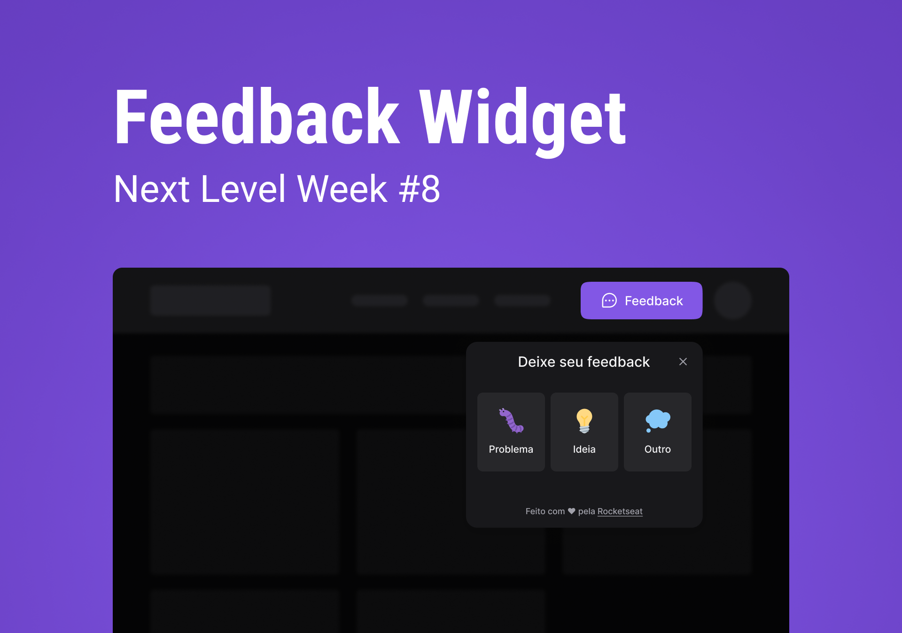

<p align="center">
  
</p>

<p align="center">
  <a href="#-projeto">Projeto</a>&nbsp;&nbsp;&nbsp;|&nbsp;&nbsp;&nbsp;
  <a href="#-demo">Demo</a>&nbsp;&nbsp;&nbsp;|&nbsp;&nbsp;&nbsp;
  <a href="#-tecnologias">Tecnologias</a>&nbsp;&nbsp;&nbsp;|&nbsp;&nbsp;&nbsp;
  <a href="#-como-executar">Como executar</a>&nbsp;&nbsp;&nbsp;|&nbsp;&nbsp;&nbsp;
  <a href="#-layout">Layout</a>&nbsp;&nbsp;&nbsp;|&nbsp;&nbsp;&nbsp;
  <a href="#-license">Licença</a>&nbsp;&nbsp;&nbsp;|&nbsp;&nbsp;&nbsp;
</p>

## 💻 Projeto

O projeto desenvolvido é uma aplicação para coleta de feedbacks que pode ser adicionado em qualquer ambiente mobile ou web.

Este é um projeto desenvolvido durante a Next Level Week, apresentado pela **[Rocketseat](https://www.rocketseat.com.br)**.

## 📱 Demo

Confira a aplicação: https://gelzieny.github.io/DoctorCare/

## 🎯 Funcionalidades

- ✔️ Envio de feedbacks
- ✔️ Screenshot com html2canvas
- ✔️ Uso do MailTrap para o envio de e-mails com os feedbacks

## 🧪 Tecnologias

Esse projeto foi desenvolvido com as seguintes tecnologias:

- [Node.js](https://nodejs.org)
- [React](https://reactjs.org)
- [Tailwindcss](https://tailwindcss.com)
- [Vite](https://vitejs.dev)
- [TypeScript](https://www.typescriptlang.org)
- [Express](https://expressjs.com)
- [Prisma](https://www.prisma.io)
- [PostgreSQL](https://www.postgresql.org)
- [Jest](https://jestjs.io)

## 🚀 Como executar

Clone o repositório e acesse a pasta.

```bash
$ git clone https://github.com/Gelzieny/feedback-widget.git
$ cd feedback-widget-g
```

Para iniciá-lo, siga os passos abaixo:

```bash
# Instalar as dependências
$ npm install

# Criar o banco de dados
$ npm prisma migrate dev

# Iniciar o projeto
$ npm run dev

# Faça uma copia do arquivo `.env.example` para `.env` e preencha com as suas credenciais
```

A aplicação pode ser acessada em [`localhost:3334`](http://localhost:3334).

## 🔖 Layout

Você pode visualizar o layout do projeto através do link abaixo:

- [Layout Web](<https://www.figma.com/file/x47rWc2NGU60S5wzMoKbLW/Feedback-Widget-(Community)?node-id=7%3A3>)

Lembrando que você precisa ter uma conta no [Figma](http://figma.com/).

## 📝 Licença

Esse projeto está sob a licença MIT. Veja o arquivo [LICENSE](LICENSE.md) para mais detalhes.

---

Made with 💜 by **[@Gelzieny](https://www.linkedin.com/in/gelzieny-r-martins-180551106/)**.
